# KineticGuard: Autonomous Workplace Safety Intelligence Platform

[](https://aws.amazon.com/)
[](https://aws.amazon.com/kinesis/video-streams/)
[](https://www.cedarpolicy.com/)
[](https://opensearch.org/)
[](https://www.python.org/)

> **Live Hosted Production Application:**  
> 🔗 **[https://kineticguard-app-637900037684.asia-south1.run.app](https://kineticguard-app-637900037684.asia-south1.run.app)**  
> *AI explains. Deterministic systems measure. Cedar policy governs.*

---

## Executive Summary

Musculoskeletal disorders (MSDs) and repetitive strain injuries are the leading cause of occupational disability in industrial, warehousing, and logistics operations. Traditional workplace camera monitoring systems suffer from critical flaws: they evaluate isolated posture snapshots, trigger endless false alarms from harmless two-second bends, expose sensitive biometric data, and provide no closed-loop mechanism to verify if interventions actually reduced risk.

**KineticGuard** is an enterprise-grade, edge-to-cloud safety intelligence platform built on the AWS ecosystem (Amazon Kinesis Video Streams, DynamoDB, S3, SageMaker, and Cedar Policy Engine) that transforms raw industrial video feeds into continuous, deterministic ergonomic risk monitoring with formal policy governance and empirical before/after validation.

### Core Engineering Invariants
1. **Movement $\neq$ Risk**: Brief bending or random movement does not trigger high risk. Risk builds strictly when awkward posture, biomechanical load, repetition, and duration persist across a rolling temporal exposure window.
2. **Privacy by Design**: Always-on facial de-identification at the edge strips personally identifiable visual information before downstream analysis. Zero face biometrics are persisted.
3. **AI Explains, Systems Measure, Policy Governs**: Deterministic physics models calculate L5/S1 spinal torque (Nm) and compression (N); Multimodal AI explains root causes; Cedar formal policy rules govern and authorize all autonomous interventions.
4. **Closed-Loop Empirical Validation**: Every dispatched intervention is re-monitored. The system measures real post-intervention telemetry and reports data sufficiency honestly without fabricating numbers.
5. **Zero Fake Data**: Real measurements only (`REAL_TELEMETRY`, `HISTORICAL`, `MODELLED`, `SIMULATED`). Missing metrics remain strict `N/A`, never converted to artificial zeros.

---

## End-to-End Visual Architecture Pipeline

```mermaid
flowchart LR
    A["01. VIDEO\n(AWS KVS / Multi-Cam)"] --> B["02. PRIVACY GUARD\n(Facial Anonymization)"]
    B --> C["03. POSE ENGINE\n(33-Point 3D Keypoints)"]
    C --> D["04. BIOMECHANICS\n(L5/S1 Torque & Compression)"]
    D --> E["05. TEMPORAL RISK\n(Cumulative Fatigue Engine)"]
    E --> F["06. INCIDENT\n(Trigger & Keyframe Snapshot)"]
    F --> G["07. KGVISION\n(Multimodal AI Reasoning)"]
    G --> H["08. POLICY GATE\n(Cedar Deterministic Rules)"]
    H --> I["09. INTERVENTION\n(Task Rotation & Rest)"]
    I --> J["10. RE-MONITOR\n(Post-Action Telemetry)"]
    J --> K["11. VERIFY\n(Empirical Validation)"]
    K -.->|Closed Loop Feedback| J
```



---

## AWS Architecture & Key System Components

### 1. Multi-Camera Ingestion & Privacy Guard (Amazon KVS + Edge)
- Multi-camera RTSP ingestion streamed via **Amazon Kinesis Video Streams (KVS)**.
- **Privacy Guard**: Real-time facial detection and Gaussian blurring running locally at the edge before frame storage or downstream analysis.
- Guarantees strict compliance with workplace biometric privacy regulations (GDPR / CCPA) while retaining full 33-point skeletal landmark geometry.

### 2. 3D Pose Engine & Deterministic Biomechanics
- **MediaPipe Pose 33-Keypoint Detection**: Sub-millimeter joint coordinate tracking for cervical, thoracic, and lumbar spine segments.
- **Biomechanical Physics Calculations**:
  - **Trunk Flexion Angle ($\theta$)**: Angular deviation from neutral vertical alignment.
  - **L5/S1 Reactive Lumbar Torque ($\tau$)**: Calculated via 3D multi-segment kinematic moments:
    $$\tau = m_{\text{torso}} \cdot g \cdot L_{\text{moment}} + m_{\text{load}} \cdot g \cdot L_{\text{reach}}$$
  - **L5/S1 Spinal Compression ($F_c$)**: Validated against the **NIOSH 3,400 N Action Limit** and 6,400 N Maximum Tolerable Limit.

### 3. Temporal Risk Engine (Cumulative Exposure)
- **Rolling Sliding Window**: 20-second continuous temporal window computing instantaneous vs sustained ergonomic load.
- **Awkward Posture Duty Cycle**: Percentage of window time spent in non-neutral posture ($>25^\circ$).
- **Repetition Cadence**: Kinematic lift-state cycle detector counting finished lift transitions (reps/min).
- **Cumulative 0–100 Risk Score**: Continuous temporal accumulation preventing false alarms from momentary posture shifts.

### 4. KGVision Multimodal Root-Cause Reasoning
- Multimodal visual reasoning engine inspecting de-identified incident keyframes and surrounding telemetry.
- Synthesizes structured technical diagnoses:
  - **Visual Observation**: Environmental setup, pallet position, and operator mechanics.
  - **Root-Cause Analysis**: Biomechanical leverage analysis explaining why risk accumulated.
  - **Remediation Recommendations**: Scissor lift tables, mechanical balancers, automated bin elevators, and ergonomic rotations.

### 5. Cedar Formal Policy Gate (AWS Cedar Engine)
- Deterministic, mathematically provable authorization engine enforcing safety policy rules before any autonomous action is executed.
- Enforces strict invariants (e.g. high-risk exposure mandates task rotation and supervisor notification).

### 6. Closed-Loop Intervention & Re-Monitoring
- Dispatches targeted ergonomic interventions and automatically transitions workers into post-intervention re-monitoring streams.
- Statistically compares pre-intervention baseline with post-intervention telemetry to empirically validate risk reduction percentage.

### 7. Predictive Ergonomic Digital Twin (What-If Simulator)
- Interactive workstation simulator modeling adjustments to working surface height (cm), load mass (kg), cadence, duration, and mandated rotation schedules.
- Output metrics are explicitly classified as `MODELLED` / `SIMULATED` to maintain total data provenance integrity.

### 8. Industrial Control-Room Dashboard & Persistent Memory (Amazon DynamoDB & OpenSearch)
- Real-time responsive web interface with dark industrial control-room aesthetics.
- **Interactive Modal Inspection**: Click any incident, worker passport, station profile, intervention, shift report, governance record, or architecture node to inspect full telemetry, keyframes, and policy decisions.
- **Spatial Warehouse Heatmap**: 2D floorplan risk visualization across all active workstations.

---

## Repository Structure

```
First commit/
├── Dockerfile                       # Production container definition
├── README.md                        # Master project documentation
├── requirements.txt                 # Pinned runtime dependencies
├── main.py                          # CLI runner for video analysis & pipeline
├── dashboard.py                     # Standalone dashboard server launcher
├── run_kineticguard.py              # Master end-to-end pipeline execution script
├── analyze_video.py                 # Multi-camera batch video analyzer
├── evaluate_risk.py                 # Biomechanical evaluation script
├── generate_dataset.py              # Synthetic ergonomic dataset generator
├── generate_sample_videos.py        # Demo video creator
├── qwen_analyze.py                  # Multimodal VLM inference script
├── train_lora.py                    # Ergonomic LoRA fine-tuning script
│
├── src/                             # Core Architecture Pipeline Modules
│   ├── __init__.py
│   ├── aws_orchestrator.py          # Unified request router & AWS mock orchestrator
│   ├── biomechanics.py              # L5/S1 spinal torque & compression physics engine
│   ├── cedar_engine.py              # Cedar deterministic formal policy gate
│   ├── cloud_storage.py             # Cloud storage abstraction (S3)
│   ├── config.py                    # Global system configuration & constants
│   ├── cumulative_risk.py           # Temporal risk accumulation & sliding window formulas
│   ├── dashboard_server.py          # Dashboard HTTP server, REST APIs, MJPEG streamer & UI
│   ├── data_normalizer.py           # Strict null fidelity & canonical data provenance classifier
│   ├── dataset_generator.py         # Ergonomic training dataset creator
│   ├── dynamo_manager.py            # Worker exposure & station risk schema manager (DynamoDB)
│   ├── event_dispatcher.py          # Local safety event dispatch engine
│   ├── exposure_forecaster.py       # Predictive fatigue forecasting engine
│   ├── gemini_analyzer.py           # Multimodal visual root-cause reasoning engine
│   ├── incident_engine.py           # Threshold detector & keyframe capture
│   ├── intervention_manager.py      # Closed-loop intervention lifecycle manager
│   ├── kvs_client.py                # Amazon Kinesis Video Streams client adapter
│   ├── kvs_manager.py               # Video stream session manager
│   ├── live_streamer.py             # OpenCV multi-camera MJPEG frame streamer
│   ├── local_opensearch.py          # Embedded OpenSearch persistent memory engine
│   ├── logger.py                    # Structured logging utility
│   ├── lora_trainer.py              # LoRA adapter trainer
│   ├── mock_aws.py                  # Local AWS ecosystem simulation
│   ├── opensearch_dashboard_backend.py # OpenSearch dashboard aggregation backend
│   ├── pose_detector.py             # MediaPipe 33-keypoint 3D body pose detector
│   ├── privacy_guard.py             # Always-on facial de-identification engine
│   ├── producer.py                  # Real-time RTSP/MP4 video stream producer
│   ├── qwen_inference.py            # Local VLM inference engine
│   ├── remonitor_engine.py          # Closed-loop post-intervention verification engine
│   ├── safety_guardian.py           # Strands safety guardian decision agent
│   ├── safety_guardian_agent.py     # Strands Agents SDK autonomous agent
│   ├── sagemaker_service.py         # Amazon SageMaker ML endpoint service adapter
│   ├── shift_reporter.py            # Executive Shift Safety Intelligence Report generator
│   ├── telemetry_exporter.py        # Frame-level JSON/CSV telemetry exporter
│   ├── temporal_analyzer.py         # Repetition cadence & duty cycle tracker
│   ├── video_source.py              # Multi-source video frame generator
│   ├── visualizer.py                # Skeleton overlay, HUD dials & bounding box renderer
│   └── whatif_simulator.py          # Digital Twin simulation physics engine
│
├── data/                            # Sample Video Feeds & Dataset
│   ├── camera_01.mp4                # Workstation 01 CCTV stream
│   ├── camera_02.mp4                # Workstation 02 CCTV stream
│   ├── camera_03.mp4                # Workstation 03 CCTV stream
│   └── ergonomic_dataset/           # Ergonomic posture training data
│
├── models/                          # Pre-cached ML Models
│   ├── pose_landmarker_lite.task    # MediaPipe pose landmark model
│   └── qwen2_vl_ergonomic_lora/     # LoRA adapter weights & configuration
│
├── output/                          # Persistent Safety Memory & Artifacts
│   ├── opensearch_data/             # Persistent OpenSearch JSON indices
│   ├── incidents/keyframes/         # De-identified incident keyframe snapshots
│   ├── shift_reports/               # Generated Shift Safety Reports (JSON & Markdown)
│   └── telemetry/                   # Per-frame biomechanical telemetry logs
│
└── tests/                           # Complete Regression & Verification Test Suite
    ├── test_interaction.py          # Dashboard modal dialog & click interaction tests
    ├── test_normalization.py        # Data source provenance & null fidelity tests
    ├── test_cloud_run_live.py       # Live deployment verification suite
    ├── test_dashboard_live.py       # Local dashboard E2E integration test
    ├── test_privacy_and_governance.py # Privacy Guard & Cedar Policy tests
    ├── test_temporal_exposure.py    # Temporal risk engine unit tests
    ├── test_phase1.py               # Video ingestion tests
    ├── test_phase2.py               # Pose & biomechanics tests
    ├── test_phase3.py               # Incident & temporal risk tests
    ├── test_phase4.py               # Multimodal AI agent tests
    ├── test_phase5.py               # Pipeline & orchestration tests
    ├── test_phase6.py               # OpenSearch memory tests
    └── test_phase6_buildit.py       # Build It dynamic data verification tests
```

---

## Quickstart Guide

### Option 1: Live Hosted Dashboard (No Setup Required)
Open in any browser: **[https://kineticguard-app-637900037684.asia-south1.run.app](https://kineticguard-app-637900037684.asia-south1.run.app)**

### Option 2: Local Execution

1. **Clone the Repository:**
   ```bash
   git clone https://github.com/Sanjeev-Sivakumar/First_commit-Algorythm.git
   cd First_commit-Algorythm
   ```

2. **Install Dependencies:**
   ```bash
   pip install -r requirements.txt
   ```

3. **Launch the Dashboard:**
   ```bash
   python dashboard.py --port 8080
   ```
   Open `http://localhost:8080` in your web browser.

4. **Run End-to-End Pipeline Demo:**
   ```bash
   python run_kineticguard.py
   ```

5. **Run Full Test Suite:**
   ```bash
   pytest test_interaction.py test_normalization.py test_cloud_run_live.py -v
   ```

---

## REST API Reference

| Endpoint | Method | Description |
| :--- | :---: | :--- |
| `/health` | `GET` | System health probe, service status, and engine diagnostics |
| `/api/overview` | `GET` | High-level safety overview, active alerts, and metrics |
| `/api/stream/telemetry` | `GET` | Live per-frame biomechanical telemetry snapshot |
| `/api/stream/video` | `GET` | Live MJPEG stream with skeleton and HUD overlay |
| `/api/stream/source` | `POST` | Switch active camera feed (`camera_01`, `camera_02`, `camera_03`, `uploaded`) |
| `/api/upload_video` | `POST` | Upload custom MP4 video for instant frame-by-frame analysis |
| `/api/incidents` | `GET` | List persistent ergonomic incidents with keyframe URLs |
| `/api/incident/<id>` | `GET` | Retrieve specific incident details, KGVision reasoning & Cedar policy |
| `/api/passports` | `GET` | Retrieve all Worker Ergonomic Passports |
| `/api/passport/<id>` | `GET` | Retrieve specific Worker Ergonomic Passport 2.0 |
| `/api/stations` | `GET` | Retrieve all workstation risk profiles |
| `/api/station/<id>` | `GET` | Retrieve specific workstation risk profile & controls |
| `/api/heatmap` | `GET` | Retrieve 2D spatial warehouse floorplan risk nodes |
| `/api/interventions` | `GET` | Retrieve closed-loop interventions & before/after validation deltas |
| `/api/intervention/<id>`| `GET` | Retrieve specific intervention record & re-monitoring stream |
| `/api/simulator/whatif` | `POST` | Execute Predictive Digital Twin simulation calculation |
| `/api/report/shift` | `GET` | Generate & download executive shift safety intelligence report |
| `/governance/audit` | `GET` | Retrieve Cedar formal policy governance evaluation log |
| `/api/privacy` | `GET` | Retrieve Privacy Guard status & biometric de-identification mode |
| `/api/download/sample_videos` | `GET` | Download sample industrial video dataset (ZIP) |

---

## Hackathon Evaluation Guide

- **Live Demo Link**: [https://kineticguard-app-637900037684.asia-south1.run.app](https://kineticguard-app-637900037684.asia-south1.run.app)
- **Interactive Dashboard**: Click on any entity card (Incidents, Workers, Stations, Interventions, Reports, Digital Twin, Architecture Nodes) to inspect real-time modal telemetry.
- **Data Integrity**: Inspect network payload responses; all missing metrics strictly show `N/A`, and data sources are explicitly marked (`REAL_TELEMETRY`, `TEST_FIXTURE`, `HISTORICAL`, `MODELLED`, `SIMULATED`).
- **Autonomous Governance**: Cedar policy rules deterministically authorize all agent recommendations.
- **Privacy Compliance**: All video feeds are de-identified at the edge before storage or display.

---

## License

This project is licensed under the MIT License — see the [LICENSE](LICENSE) file for details.
